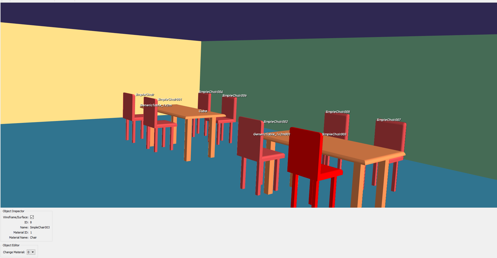

# AMFVisualizer
This repository contains a python application (using Mayavi library) to visualize and edit AMF files. 

## Features:
1. This application allows to visualize the geometry of an AMF file.
1. It also supports the update of the objects material (BETA).

The AMFVisualizer software comes with three different AMF Files:
1. NISTParkingLot.xml
1. LectureRoomTablesChairs.xml
1. NISTGaithersburg.xml

Here is a sample snapshot for our AMFVisualizer:

# Download Information:
Just clone or download the repository.

# Installation
Please refer to *"Install.txt"* document in the *"Source"* folder.

# Usage 
Please refer to *"README.txt"* document in the *"Source"* folder.

# Author Information:
The AMFVisualizer is developed and maintained by [Tanguy Ropitault](https://www.nist.gov/people/tanguy-ropitault).

